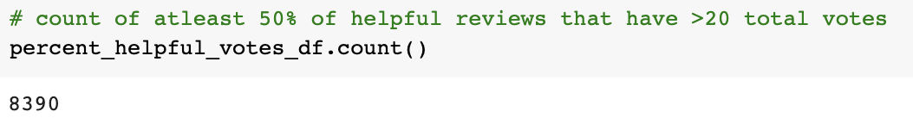
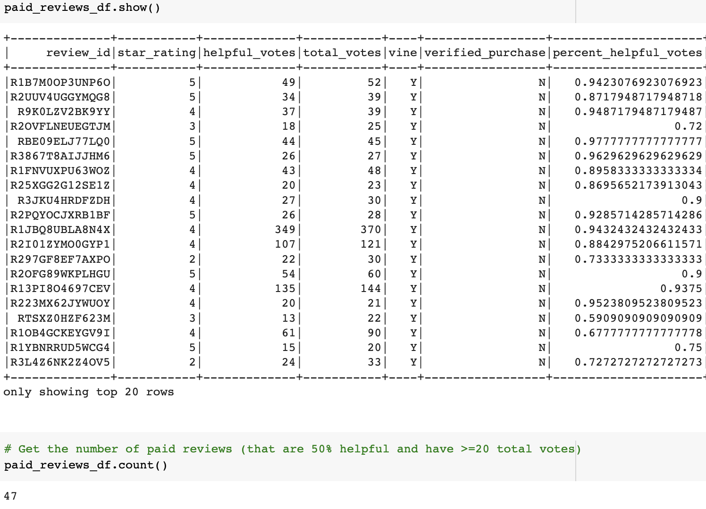
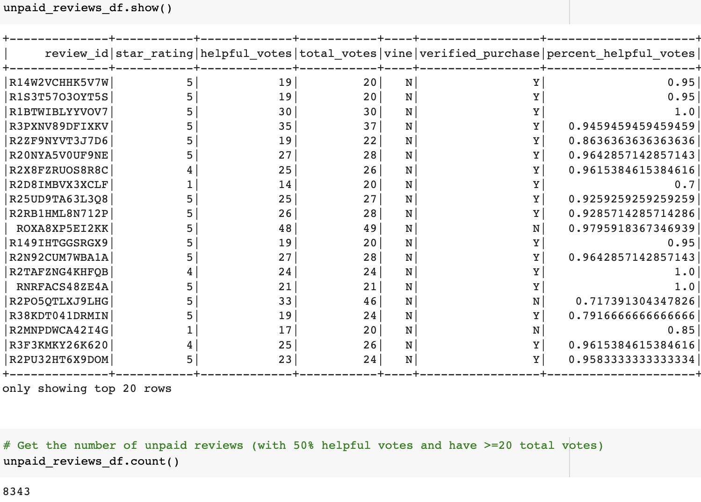
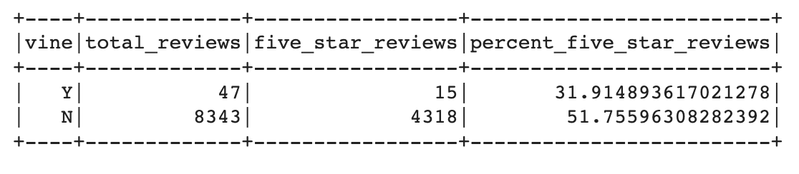
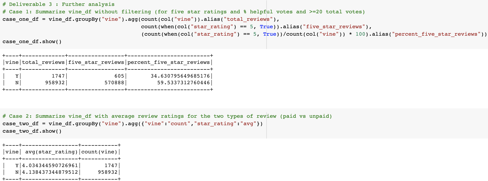

# Amazon_Vine_Analysis

Analysis of Amazon's vine review program using PySpark and AWS RDS with PostgreSQL.

## Overview

The project aims to help an account manager at BigMarket get an overview of what big data actually is. Then, Amazon reviews written by members of the paid Amazon Vine program are to be analyzed so that recommendations can be made to clients about Vine program. The Amazon Vine program is a service that allows manufacturers and publishers to receive reviews for their products. Companies pay a small fee to Amazon and provide products to Amazon Vine members, who are then required to publish a review. The below tasks are accomplished:
- Explain how MapReduce processes big data within Hadoop context.
- Use Python's MRJob to practice MapReduce outside Hadoop system.
- Describe how NLP collects and analyzes text data. 
- Use PySpark in Google Colab to extract and process data.
- Use NLP in conjunction with PySpark to build NLP pipeline.
- Use AWS Simple Storage Service (S3) and relational databases for basic cloud storage.
- Analyze Amazon reviews written by members of the paid Amazon Vine program as follows:
  - Use PySpark to perform the ETL process to extract the Watch reviews dataset and transform the data. 
  - Connect to an AWS RDS instance, and load the transformed data into pgAdmin.
  - Use PySpark to determine if there is any bias toward favorable reviews from Vine members in dataset.

## Resources

- Apache Spark 3.3.1
- MRJob-0.7.4
- NLKT
- Google Colaboratory
- AWS Relational Database Service (RDS) and Simple Storage Service (S3)
- SQL and PgAdmin
- Amazon customer review datasets

## Results

### Extract-Transform-Load of Amazon Product Reviews

- Of the 50 datasets of amazon reviews, **Watches** category is analyzed for this project. The dataset can be found [here](https://s3.amazonaws.com/amazon-reviews-pds/tsv/amazon_reviews_us_Watches_v1_00.tsv.gz).
- The Watches reviews dataset has over 960K reviews. All of the data is extracted into a dataframe, which is then transformed into four separate dataframes that match the database table schema as shown below: 
<table>
  <tr>
    <td></td>
    <td></td>
  </tr>
  <tr>
    <td></td>
    <td></td>
  </tr>
</table>

- The transformed data is uploaded into the appropriate database tables.
<table>
  <tr>
    <td></td>
    <td></td>
  </tr>
  <tr>
    <td></td>
    <td></td>
  </tr>
</table>

### Determine Bias of Amazon Reviews

- **PySpark** is used to analyze Vine reviews data, to determine if a paid Vine review makes a difference in the percentage of 5-star reviews. In order to focus on reviews that would be considered more likely to be helpful, the dataset is filtered so that:
  - the count of total votes is equal to or greater than 20.
  - Percentage of helpful votes to total votes is equal to or greater than 50%.
-  Based on above filters, there are **a total of 8390 helpful reviews** in Vine and non-Vine services combined.
<table>
  <tr><td>Total Reviews</td></tr>
  <tr><td></td></tr>
</table>

- There are **47 reviews on Vine** services and **8343 reviews on non-Vine** services. This shows that Vine members made just 0.6% of total reviews while non-Vine members contributed over 99.4% of reviews.  
<table>
  <tr>
   <td>Vine Reviews:</td>
   <td>Non-Vine Reviews: </td>
 </tr>
 <tr>
   <td></td>
   <td></td>
 </tr>
</table>

- It is found that **15 Vine members gave five-star reviews** of the total 47 Vine reviews collected. This shows that **32% of Vine members gave 5-star ratings**.
- There are **4318 five-star non-Vine reviews** of the total 8343 non-Vine reviews collected. This shows that around **52% of non-Vine reviews are 5-star ratings**.
<table>
  <tr><td>Review Summary:</td></tr>
  <tr><td></td></tr>
</table>

## Summary

- Based on the results above, it can be seen that Vine members contribute less (0.6% vs. 99.4%) helpful reviews compared to non-Vine members in the Watches category.
- 32% of Vine members gave 5-star ratings while 52% of non-Vine members gave 5-stars. This shows that Vine members gave 38% less 5-star ratings compared to that of non-Vine members. **It can be assumed that Vine members did not show bias when rating their products** instead they were more critical while submitting the review.
- To support the assumption further, additional analysis can be done to include all the review data instead of filtering based on the total votes and percentage helpful votes. 
- The average star rating could also be calculated as part of further analysis to see if the incentives provided through Vine program are beneficial. The queries would be as shown in the below image: 
<table>
  <tr>
   <td></td>
 </tr>
 </table>
 
 - In fact, after running the above two queries, the trend seems to be the same. Further, NLP sentiment analysis can be done to check for the words used in the majority of the reviews. This can help to see if vine reviews are more touching and detailed, so that customers have an incentive to leave great reviews. 
