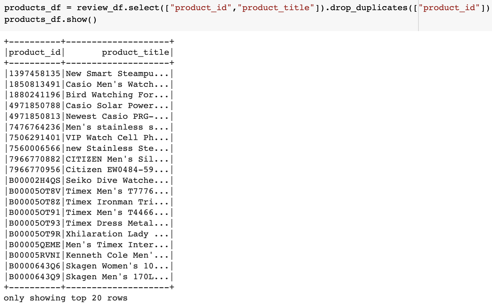
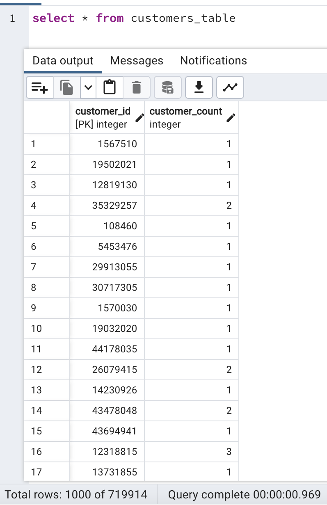

# Amazon_Vine_Analysis

Analysis of Amazon's vine review program using PySpark and AWS RDS with PostgreSQL.

## Overview

The project aims to help an account manager at BigMarket get an overview of what big data actually is. Then, Amazon reviews written by members of the paid Amazon Vine program are to be analyzed. The Amazon Vine program is a service that allows manufacturers and publishers to receive reviews for their products. Companies pay a small fee to Amazon and provide products to Amazon Vine members, who are then required to publish a review. The below tasks are accomplished:
- Explain how MapReduce processes big data within Hadoop context.
- Use Python's MRJob to practice MapReduce outside Hadoop system.
- Describe how NLP collects and analyzes text data. 
- Use PySpark in Google Colab to extract and process data.
- Use NLP in conjunction with PySpark to build NLP pipeline.
- Use AWS Simple Storage Service (S3) and relational databases for basic cloud storage.
- Analyze Amazon reviews written by members of the paid Amazon Vine program as follows:
  - Use PySpark to perform the ETL process to extract the Watch reviews dataset and transform the data. 
  - Connect to an AWS RDS instance, and load the transformed data into pgAdmin.
  - Use PySpark to determine if there is any bias toward favorable reviews from Vine members in dataset.

## Resources

- Apache Spark 3.3.1
- MRJob-0.7.4
- NLKT
- Google Colaboratory
- AWS Relational Database Service (RDS) and Simple Storage Service (S3)
- Amazon customer review datasets

## Results

- Of the 50 datasets of amazon reviews, **Watches** category is analyzed for this project. The dataset can be found [here](https://s3.amazonaws.com/amazon-reviews-pds/tsv/amazon_reviews_us_Watches_v1_00.tsv.gz).
- The Watches reviews dataset is extracted into a dataframe, which is then transformed into four separate dataframes that match the database table schema as shown below: 
<table>
  <tr>
    <td></td>
    <td></td>
  <tr>
  <tr>
    <td></td>
    <td></td>
  <tr>
</table>

- The transformed data is uploaded into the appropriate database tables.
<table>
  <tr>
    <td></td>
    <td></td>
  <tr>
  <tr>
    <td></td>
    <td></td>
  <tr>
</table>
- Using bulleted lists and images of DataFrames as support, address the following questions:
- How many Vine reviews and non-Vine reviews were there?
- How many Vine reviews were 5 stars? How many non-Vine reviews were 5 stars?
- What percentage of Vine reviews were 5 stars? What percentage of non-Vine reviews were 5 stars?

## Summary
- State if there is any positivity bias for reviews in the Vine program. Use the results of your analysis to support your statement. 
- Then, provide one additional analysis that you could do with the dataset to support your statement.
